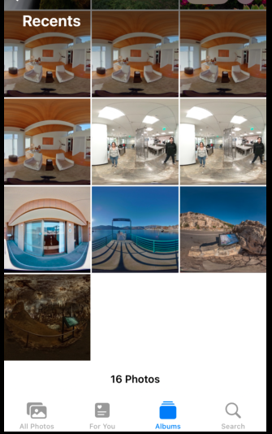

# React Native iOS permissions test

Save network images to iOS Camera Roll or separate album.
Download image to local application storage on iOS device with
react-native-blob-util then copy to album.

Set permission with user agreement.  Stores permissions in app.

## Features

### album

### gallery

### view as equirectangular

### verify permissions

### delete and manage photos using iOS photos app

## Tips

### Packages Used

* react-native-permissions
* @react-native-camera-roll/camera-roll
* react-native-blob-util

## Sample Images

* https://fake-theta.vercel.app/files/150100525831424d42075b53ce68c300/100RICOH/R0010015.JPG
